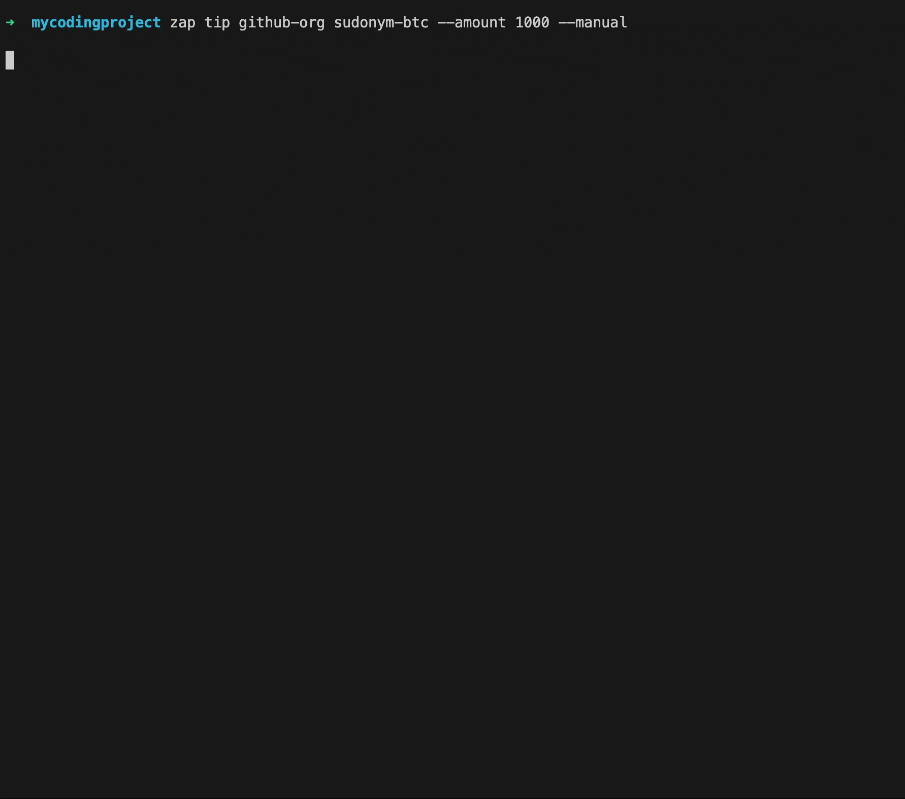

# zap

zap is an executable for developers to install on their machines.

During development, you can use the zap command to tip the maintainers of your dependency in the world's only properly engineered money (bitcoin).

## Installation

```
brew tap sudonym-btc/zap
brew install zap && zap cmdInit $0
```

### Connect to your wallet
Use a bitcoin wallet with Nostr-Wallet-Connect functionality.
Create a new app within the wallet and set spending limits.
Copy the connect secret and run

```
zap connect
```

Give it a test!
```
zap tip github-org sudonym-btc --amount 2100
```




Some (most) of your favourite software maintainers probably don't have lightning-enabled addresses listed in their profile information. So if we can't find an address to directly send bitcoin to, you can hook up zap to your personal email account in order to send those maintainers an email with a link to redeem their tips (and optionally nudge them to join the bitcoin train!).

```
zap email
```

You will need to know your SMTP auth details to set this up. For GMail, follow these instructions: 
https://hotter.io/docs/email-accounts/app-password-gmail/

Then, when you run 

`zap tip [optionals] --sendEmails`

it will attempt to create a lightning gift and send it as an email.

Try it:

```
zap tip patrick.geyer1@gmail.com --sendEmails --manual
```

For more fine grained control, you can use the `--manual`. This will let you confirm amounts and messages before sending anything out.

By default, zap will listen to commands you execute when developing. If it detects that you're installing packages, it automatically prompts you to tip the maintainers in order to keep us generous.
You can ctrl+c to exit this process


<!-- You can disable this auto-prompt behaviour with

```
zap config set ---cmd-listener=false
``` -->

## Disclaimer

When you connect zap to your wallet, those credentials are stored obscured, but not encrypted on your machine. 

Make sure you only give the zap app minimal spending permissions from your wallet.

Be safe, and be generous!
